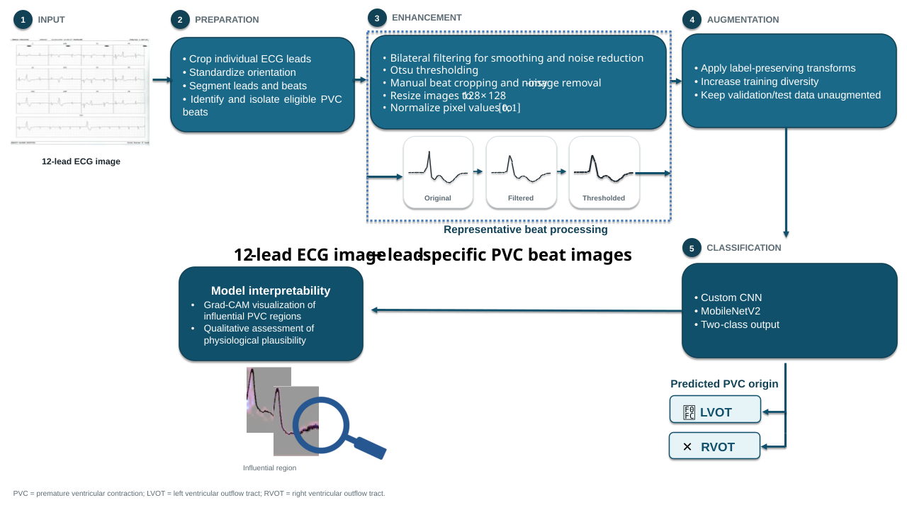

<div align="center">

# 🫀 Scanned Electrocardiogram-Based Deep Learning for Localizing the Origin of Premature Ventricular Complexes

**Image-based classification of LVOT vs. RVOT PVC origin from scanned 12-lead ECGs**

[](LICENSE)
[](https://www.python.org/)
[]()
[]()

Fatemeh Davarinia¹ · Afrooz Arzehgar² · Feisal Rahimpour³ · Davood Ramezaninezhad⁴

<sub>¹ Biomedical Engineering, Semnan University · ² Medical Informatics, Mashhad University of Medical Sciences ·
³ Pediatric & Congenital Cardiology, MUMS · ⁴ Interventional Electrophysiology, Rajaie Cardiovascular Medical & Research Center</sub>

</div>

---

## 🖼️ Graphical Abstract

<div align="center">

</div>

---

## 📌 Overview

Premature ventricular complexes (PVCs) arising from the **right** or **left ventricular outflow tract** (RVOT / LVOT) can look deceptively similar on the surface ECG, yet the distinction matters for electrophysiological workup and catheter-ablation planning. Most automated approaches assume access to raw digital ECG waveforms — a luxury that many clinical archives, especially in resource-limited settings, simply don't have.

This repository accompanies a study that asks a more practical question: **can a model localize PVC origin directly from a scanned, paper-based 12-lead ECG image — no digital signal required?**

We built and compared two image-based deep learning classifiers on lead-specific PVC beat images extracted from scanned ECGs of 59 patients with electroanatomically confirmed LVOT/RVOT origin, then stress-tested the result against a conventional ECG rule and probed model attention with Grad-CAM.

## ✨ Key Highlights

- 🖨️ **Scanned-image input** — flatbed-scanned paper ECGs (300 dpi), not raw digital waveforms
- 🧠 **Two architectures compared** — a lightweight custom CNN vs. transfer-learned **MobileNetV2**
- 🏆 **Best result** — MobileNetV2: **ACC 0.74 · Sensitivity 0.78 · Specificity 0.70 · F1 0.75 · AUC 0.84**
- 🧍 **Leakage-free evaluation** — strict **patient-level** partitioning across CV folds and a fully held-out test set
- 📊 **Rigorous lead-level statistics** — Clopper–Pearson CIs, exact binomial tests, Holm correction across 12 leads
- 🔍 **Explainability** — Grad-CAM localizes attention to QRS-related morphology, mainly in precordial leads
- ⚖️ **Benchmarked against clinical baseline** — V2S/V3R index (AUC 0.557) vs. MobileNetV2 (AUC 0.84)

## 🧬 Methodology Pipeline

The full pipeline — shown in the graphical abstract above — proceeds through five stages:

| Stage | What happens |
|---|---|
| **1. Input** | 12-lead ECG paper trace, scanned at 300 dpi (grayscale, JPG, quality 100%) |
| **2. Preparation** | Lead cropping, orientation standardization, PVC beat segmentation and isolation |
| **3. Enhancement** | Bilateral filtering, Otsu thresholding, 128×128 resizing, [0,1] normalization |
| **4. Augmentation** | Rotation (±10°), translation/zoom (±10%), compression variability — training folds only |
| **5. Classification** | Custom CNN vs. MobileNetV2 → binary LVOT/RVOT prediction, with Grad-CAM interpretability |

Each **PVC beat, per ECG lead**, is treated as an independent image-level input — the model never sees the raw 12-lead recording as a single unit, and every partitioning step is enforced **at the patient level** to prevent leakage.

## 📈 Results

### Model comparison

| Model | ACC | Precision | Sensitivity | Specificity | F1-score | AUC |
|---|:---:|:---:|:---:|:---:|:---:|:---:|
| Custom CNN | 0.68 | 0.72 | 0.69 | 0.66 | 0.70 | 0.72 |
| **MobileNetV2** | **0.74** | 0.72 | **0.78** | **0.70** | **0.75** | **0.84** |


> ⚠️ **Clinical framing:** This model is an exploratory decision-support tool, not a substitute for intracardiac mapping or a basis for autonomous catheter-ablation decisions.

## 📂 Repository Structure

```
.
├── 01_preprocess_beats.py            # Lead cropping, enhancement, PVC beat extraction
├── 02_train_subject_level.CNN.py     # Custom CNN training (patient-level CV)
├── 03_train_subject_level_mobilenetv2.py  # MobileNetV2 training (patient-level CV)
├── LVOT.rar                          # De-identified LVOT PVC beat images (extract before use)
├── RVOT.rar                          # De-identified RVOT PVC beat images (extract before use)
├── graphical_abstract.svg
├── requirements.txt
└── README.md
```

## 🚀 Getting Started

```bash
git clone https://github.com/AfroozArzehgar/Scanned-ECG-PVC-Classifier.git
cd Scanned-ECG-PVC-Classifier
pip install -r requirements.txt
```

```bash
# Example: preprocess scanned ECGs into PVC beat images
python 01_preprocess_beats.py

# Train the MobileNetV2 classifier with patient-level cross-validation
python 03_train_subject_level_mobilenetv2.py
```

## 📊 Data Availability

De-identified subsets of PVC beat images used for model training and evaluation are provided in this repository as `LVOT.rar` and `RVOT.rar`. Extract these archives (e.g. using [7-Zip](https://www.7-zip.org/) or `unrar`) before running the scripts:

```bash
unrar x LVOT.rar
unrar x RVOT.rar
```

Note: these subsets are provided for illustrative/reproducibility purposes and do not represent the full training/test cohort. The original full-resolution clinical ECG scans and complete patient-level dataset are **not publicly available**, as they were obtained under institutional ethical approval; they may be shared by the corresponding author upon reasonable request, subject to institutional and ethical requirements.

## 🧾 Study Population & Ethics

59 patients (37 M / 22 F, mean age 50 ± 5) with electrophysiologically confirmed LVOT/RVOT PVCs, Imam Reza Hospital, Mashhad University of Medical Sciences (2020–2024). Approved by the Ethics Committee of Imam Reza Hospital (**IR.MUMS.REC.1403.307**), in accordance with the Declaration of Helsinki. Written informed consent obtained from all participants.

## ⚠️ Limitations

- Single beat / single lead as input — no surrounding sinus rhythm or full temporal context
- Only RVOT vs. LVOT origins represented (no papillary muscle, tricuspid annulus, or epicardial sites)
- Single-center cohort of 59 patients — external, multicenter validation still needed
- Scanned-image representation may lose information relative to native digital signals
- Grad-CAM interpretation is qualitative, not quantitatively validated against expert annotation

## 📖 Citation

If you use this code or build on this work, please cite:

```bibtex
@article{,
  title   = {Scanned Electrocardiogram-Based Deep Learning for Localizing the Origin of Premature Ventricular Complexes},
  author  = {Davarinia, Fatemeh and Arzehgar, Afrooz and Rahimpour, Feisal and Ramezaninezhad, Davood},
  year    = {2026}
}
```

## 🤝 Authors' Contributions

**F.D.** — conceptualization, methodology, data analysis, manuscript drafting · **A.A.** — data preprocessing, model implementation · **F.R. & D.R.** — clinical data acquisition, patient evaluation, electrophysiological validation.

## 📬 Contact

- Fatemeh Davarinia — f_davarinia@semnan.ac.ir
- Afrooz Arzehgar — arzegara4011@mums.ac.ir

## 📄 License

Released under the [MIT License](LICENSE) unless noted otherwise.

</div>
